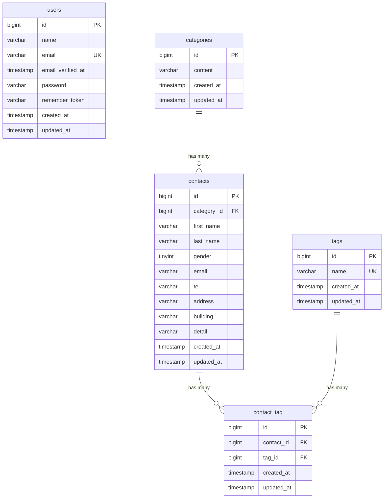

# COACHTECH お問い合わせフォームアプリ

お問い合わせの入力・確認・送信を行うWebアプリケーションです。
管理者はログイン後、お問い合わせの一覧表示・検索・詳細確認・削除や、
タグの登録・編集・削除を行うことができます。

Unit Test・Feature Testを実装し、テストカバレッジ70%以上を確認しています。

## 作成者

志賀 由美子

## 使用技術

- PHP 8.5.6
- Laravel 10.50.3
- Laravel Fortify 1.36.2
- MySQL 8.4.11
- Laravel Sail 1.67.0
- Tailwind CSS 3.4.19
- Vite 5.4.21
- Alpine.js 3

## ER図



## 開発環境URL

http://localhost

管理画面：http://localhost/admin

phpMyAdmin：http://localhost:8080

## 動作環境

DockerおよびLaravel Sailを使用した開発環境で動作します。

WebアプリケーションはLaravelで構築し、データベースにはMySQLを使用しています。
フロントエンドのビルドにはViteを使用しています。

## 環境構築手順

1. **リポジトリをクローン**

```bash
$ git clone https://github.com/totosmy2718-netizen/contact-form-app.git
$ cd contact-form-app
```

2. **.envファイルの準備**

`.env.example`をコピーして`.env`を作成します。

```bash
$ cp .env.example .env
```

3. **Composer依存パッケージのインストール**

```bash
$ docker run --rm \
  -u "$(id -u):$(id -g)" \
  -v "$(pwd):/var/www/html" \
  -w /var/www/html \
  -e COMPOSER_CACHE_DIR=/tmp/composer_cache \
  laravelsail/php82-composer:latest \
  composer install --ignore-platform-reqs
```

4. **Laravel Sailの起動**

```bash
$ ./vendor/bin/sail up -d
```

5. **アプリケーションキーの生成**

```bash
$ ./vendor/bin/sail artisan key:generate
```

6. **データベースのマイグレーションと初期データ投入**

```bash
$ ./vendor/bin/sail artisan migrate --seed
```

Seederにより、カテゴリ・タグ・テストユーザー・お問い合わせの初期データが登録されます。

管理画面の動作確認には以下のテストユーザーを使用できます。

```text
メールアドレス：test@example.com
パスワード：password
```

7. **フロントエンドのビルド**

依存パッケージをインストールします。

```bash
$ ./vendor/bin/sail npm install
```

開発環境でViteを起動します。（起動したままにしておく）

```bash
$ ./vendor/bin/sail npm run dev
```

8. **アプリケーションへのアクセス**

ブラウザで以下にアクセスします。

```text
http://localhost
```

管理画面：

```text
http://localhost/admin
```

phpMyAdmin：

```text
http://localhost:8080
```

## テスト実行

Unit TestおよびFeature Testを実装しています。

すべてのテストを実行する場合：

```bash
$ ./vendor/bin/sail artisan test
```

Unit Testのみ実行する場合：

```bash
$ ./vendor/bin/sail artisan test tests/Unit
```

Feature Testのみ実行する場合：

```bash
$ ./vendor/bin/sail artisan test tests/Feature
```

テストカバレッジを確認する場合：

```bash
$ ./vendor/bin/sail artisan test --coverage
```

テストカバレッジは **83.1%** で、要件の70%以上を満たしています。

## 機能一覧

- お問い合わせフォーム入力
- お問い合わせ内容の確認
- お問い合わせ送信
- お問い合わせ完了画面
- カテゴリ選択
- タグの複数選択
- ユーザー新規登録
- ログイン・ログアウト
- 管理画面への認証制御
- お問い合わせ一覧表示
- キーワード検索
- 性別検索
- カテゴリ検索
- 日付検索
- お問い合わせ一覧のページネーション
- お問い合わせ詳細表示
- お問い合わせ削除
- タグ登録
- タグ編集
- タグ削除
- Unit Test
- Feature Test

## APIエンドポイント一覧

公開APIとして、お問い合わせの取得・登録・更新・削除を実装しています。

| メソッド | エンドポイント               | 内容                                         |
| -------- | ---------------------------- | -------------------------------------------- |
| GET      | `/api/v1/contacts`           | お問い合わせ一覧取得・検索・ページネーション |
| GET      | `/api/v1/contacts/{contact}` | お問い合わせ詳細取得                         |
| POST     | `/api/v1/contacts`           | お問い合わせ登録                             |
| PUT      | `/api/v1/contacts/{contact}` | お問い合わせ更新                             |
| DELETE   | `/api/v1/contacts/{contact}` | お問い合わせ削除                             |

一覧取得では、以下の検索条件を指定できます。

- `keyword`
- `gender`
- `category_id`
- `date`
- `per_page`
- `page`

APIは認証不要の公開APIです。
